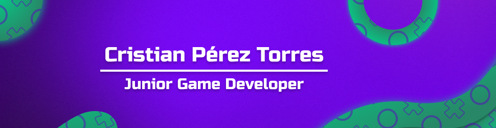

  <h1 align="center">Hi, I'm Cristian Pérez Torres</h1> 👋

## Sobre mí

- 🎮 Estudiante de Unity & Unreal Engine 🎮  
- 📲 Desarrollador multiplataforma  
- 🧠 Aprendiz rápido y solucionador creativo de problemas, siempre en busca de soluciones innovadoras  
- 🔍 Curioso por naturaleza, con un fuerte deseo de explorar nuevas tecnologías  
- 🌱 Siempre en evolución, mejorando mis habilidades a través de proyectos prácticos  
- 💬 Comunicador eficaz, trabajando de manera colaborativa en equipos  

---

### ⚙️ &nbsp;GitHub Analytics

  <a href="https://github.com/Rubiio14">
     
    
  </a>

<!--
**Rubiio14/Rubiio14** is a ✨ _special_ ✨ repository because its `README.md` (this file) appears on your GitHub profile.

Here are some ideas to get you started:

- 🔭 I’m currently working on ...
- 🌱 I’m currently learning ...
- 👯 I’m looking to collaborate on ...
- 🤔 I’m looking for help with ...
- 💬 Ask me about ...
- 📫 How to reach me: ...
- 😄 Pronouns: ...
- ⚡ Fun fact: ...
-->
